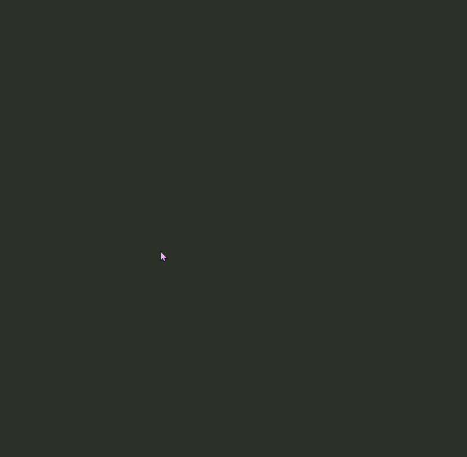

# convex-hull
A few convex hull algorithm implementations in C++

###### Convex Hull

[wiki](https://en.wikipedia.org/wiki/Convex_hull)

###### Interactive Python Version
**click to add points**
**| up arrow to draw convex hull**
